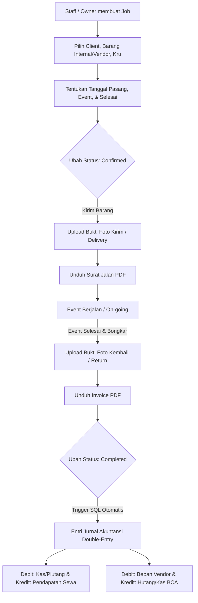

# Panduan Pengembangan (Development Guidelines)

**PENTING: ATURAN MUTLAK TERKAIT INTEGRITAS DATA**

Ketika melakukan pengembangan, penambahan fitur, atau modifikasi apa pun pada website ini di masa mendatang, Anda **DIWAJIBKAN** untuk mematuhi aturan berikut secara ketat:

1. **Preservasi Data Utama**: Semua data yang saat ini sudah ada di dalam website **TIDAK BOLEH dihapus, ditimpa, atau diganti**. Biarkan data yang sudah ada tetap utuh seperti apa adanya sekarang.
2. **Pengembangan Bersifat Aditif (Menambahkan, Bukan Mengurangi)**: Jika ada penambahan fitur baru apa pun, lakukan penambahan (*append*) tanpa merusak atau menghilangkan fungsionalitas dan data lama. Fitur baru harus diimplementasikan dengan cara menambahkan kode/data baru, bukan menghapus atau mengubah data yang sudah berjalan.
3. **Integritas Sistem (Sesuai Standar Cashflow)**: Layaknya pengembangan pada proyek *cashflow*, data lama harus selalu dijaga sebagai data permanen yang tidak tergantikan.
4. **Perubahan Skema/Struktur**: Apabila fitur baru memerlukan perubahan struktur data, pastikan untuk menambahkan *field* atau skema baru tanpa membuang atau memodifikasi *field* lama yang telah ada nilainya.
5. **Akses Pengguna (Role Guest)**: Pengguna dengan role `guest` secara mutlak **tidak diperbolehkan** melihat saldo, laporan keuangan secara keseluruhan (seperti Neraca Saldo, Neraca Lajur, dll), aktiva tetap, atau data transaksi yang dibuat oleh pengguna lain (khususnya milik Owner). Hak akses mereka dibatasi hanya pada data transaksi yang mereka buat sendiri.

Aturan ini dibuat untuk memastikan website yang berjalan sekarang tidak mengalami kehilangan data penting selama proses penambahan atau pembaruan sistem di kemudian hari.

---

# Rencana Implementasi & Perancangan Ulang Sistem Dashboard ERP
**Beragam Sewa Bali — POS & Rental Management System**

Sistem ini dirancang untuk mengintegrasikan manajemen penyewaan alat event (sound system, genset, tenda, dekorasi, dll.) di Bali dengan pencatatan keuangan akuntansi *double-entry* pada platform `cashflow.beragamsewabali.com`.

## 1. Matriks Akses Pengguna (Role-Based Access Control)

Sistem menggunakan hak akses berbasis peran (RBAC) dengan kebijakan Row Level Security (RLS) di Supabase.

| Fitur / Halaman | Owner | Accounting | Staff | Guest |
| :--- | :---: | :---: | :---: | :---: |
| **Ringkasan (Dashboard Analytics)** | Ya (Penuh) | Ya (Penuh) | Ya (Terbatas) | Ya (Data Sendiri) |
| **Manajemen Akun (COA)** | Ya (Penuh) | Ya (Penuh) | Lihat Saja | Tidak Boleh |
| **Aktiva Tetap (Fixed Assets)** | Ya (Penuh) | Ya (Penuh) | Tidak Boleh | Tidak Boleh |
| **Transaksi Jurnal Keuangan** | Ya (Penuh) | Ya (Penuh) | Tidak Boleh | Hanya Milik Sendiri |
| **Neraca Lajur & Laporan** | Ya (Penuh) | Ya (Penuh) | Tidak Boleh | Tidak Boleh |
| **Manajemen Item & Inventaris** | Ya (Penuh) | Lihat Saja | Ya (Ubah Status) | Tidak Boleh |
| **Manajemen Supplier/Vendor** | Ya (Penuh) | Lihat Saja | Lihat Saja | Tidak Boleh |
| **Manajemen Job / Sewa** | Ya (Penuh) | Lihat Saja | Ya (Kelola Job) | Hanya Milik Sendiri |
| **Bukti Foto Serah Terima** | Ya (Penuh) | Lihat Saja | Ya (Upload) | Hanya Milik Sendiri |
| **Generasi Surat Jalan & Invoice PDF**| Ya (Penuh) | Ya (Penuh) | Ya (Hanya Surat Jalan) | Tidak Boleh |
| **Audit Logs** | Ya (Penuh) | Tidak Boleh | Tidak Boleh | Tidak Boleh |

> [!IMPORTANT]
> Khusus untuk role `guest`, RLS di database harus membatasi record yang tampil agar hanya menampilkan transaksi dan job yang kolom `created_by` nilainya sama dengan `auth.uid()`.

---

## 2. Perluasan Skema Database (Supabase PostgreSQL)

Untuk menampung fitur *Job/Rental Management*, kru lapangan, integrasi vendor, foto bukti, dan integrasi otomatis dengan sistem jurnal keuangan, berikut adalah rancangan tabel tambahan yang wajib dieksekusi di Supabase SQL Editor.

```sql
-- ============================================================
-- 1. ENUMS & TYPES
-- ============================================================
DO $$ BEGIN
    CREATE TYPE job_status AS ENUM ('draft', 'confirmed', 'on_going', 'completed', 'cancelled');
EXCEPTION WHEN duplicate_object THEN NULL;
END $$;

DO $$ BEGIN
    CREATE TYPE proof_type AS ENUM ('delivery', 'return');
EXCEPTION WHEN duplicate_object THEN NULL;
END $$;

-- ============================================================
-- 2. TABLES
-- ============================================================

-- Tabel Utama Manajemen Job / Event Rental
CREATE TABLE IF NOT EXISTS public.jobs (
    id                UUID PRIMARY KEY DEFAULT uuid_generate_v4(),
    client_name       TEXT NOT NULL,
    client_phone      TEXT,
    client_email      TEXT,
    description       TEXT,
    venue             TEXT NOT NULL,
    setup_date        DATE NOT NULL,                       -- Tanggal pemasangan alat
    job_date          DATE NOT NULL,                       -- Tanggal event berlangsung
    completion_date   DATE NOT NULL,                       -- Tanggal pembongkaran/selesai
    status            job_status NOT NULL DEFAULT 'draft',
    total_rental_fee  NUMERIC(15, 2) NOT NULL DEFAULT 0.00 CHECK (total_rental_fee >= 0),
    total_vendor_cost NUMERIC(15, 2) NOT NULL DEFAULT 0.00 CHECK (total_vendor_cost >= 0),
    payment_method    TEXT DEFAULT 'Cash',                 -- Cash, BCA Transfer, dll
    cashflow_tx_id    UUID REFERENCES public.transactions(id) ON DELETE SET NULL, -- Link ke Jurnal
    created_by        UUID NOT NULL REFERENCES auth.users(id) ON DELETE SET NULL,
    created_at        TIMESTAMPTZ DEFAULT now(),
    updated_at        TIMESTAMPTZ DEFAULT now()
);

-- Tabel Logistik Barang (Kombinasi Barang Internal & Sub-Sewa Vendor)
CREATE TABLE IF NOT EXISTS public.job_items (
    id                UUID PRIMARY KEY DEFAULT uuid_generate_v4(),
    job_id            UUID NOT NULL REFERENCES public.jobs(id) ON DELETE CASCADE,
    item_id           UUID REFERENCES public.items(id) ON DELETE SET NULL,        -- NULL jika murni barang vendor
    item_name_custom  TEXT,                                                       -- Diisi jika sewa dari vendor luar
    quantity          INT NOT NULL DEFAULT 1 CHECK (quantity > 0),
    source_vendor_id  UUID REFERENCES public.suppliers(id) ON DELETE SET NULL,     -- Terisi jika barang outsource/sub-sewa
    sub_rent_cost     NUMERIC(15, 2) DEFAULT 0.00 CHECK (sub_rent_cost >= 0),     -- Biaya bayar ke vendor jika ada
    is_returned       BOOLEAN NOT NULL DEFAULT false,
    created_at        TIMESTAMPTZ DEFAULT now()
);

-- Tabel Penugasan Kru / Karyawan pada Job
CREATE TABLE IF NOT EXISTS public.job_staff (
    id                UUID PRIMARY KEY DEFAULT uuid_generate_v4(),
    job_id            UUID NOT NULL REFERENCES public.jobs(id) ON DELETE CASCADE,
    profile_id        UUID NOT NULL REFERENCES public.profiles(id) ON DELETE CASCADE,
    role_in_job       TEXT NOT NULL,                                              -- Soundman, Driver, Helper, dll
    created_at        TIMESTAMPTZ DEFAULT now()
);

-- Tabel Bukti Foto Lapangan (Serah Terima & Pengembalian)
CREATE TABLE IF NOT EXISTS public.job_proofs (
    id                UUID PRIMARY KEY DEFAULT uuid_generate_v4(),
    job_id            UUID NOT NULL REFERENCES public.jobs(id) ON DELETE CASCADE,
    type              proof_type NOT NULL,                                        -- delivery / return
    photo_url         TEXT NOT NULL,                                              -- URL Supabase Storage
    uploaded_by       UUID REFERENCES auth.users(id) ON DELETE SET NULL,
    created_at        TIMESTAMPTZ DEFAULT now()
);

-- ============================================================
-- 3. ROW LEVEL SECURITY (RLS) POLICIES
-- ============================================================
ALTER TABLE public.jobs ENABLE ROW LEVEL SECURITY;
ALTER TABLE public.job_items ENABLE ROW LEVEL SECURITY;
ALTER TABLE public.job_staff ENABLE ROW LEVEL SECURITY;
ALTER TABLE public.job_proofs ENABLE ROW LEVEL SECURITY;

-- Policy untuk Tabel Jobs
CREATE POLICY "Jobs readable by authorized roles"
ON public.jobs FOR SELECT TO authenticated
USING (
  public.get_user_role() IN ('owner', 'accounting')
  OR (public.get_user_role() = 'staff')
  OR (public.get_user_role() = 'guest' AND created_by = auth.uid())
);

CREATE POLICY "Jobs modifiable by owner and staff"
ON public.jobs FOR ALL TO authenticated
USING (
  public.get_user_role() IN ('owner', 'staff')
  OR (public.get_user_role() = 'guest' AND created_by = auth.uid())
);

-- (Terapkan kebijakan RLS serupa secara kaskade untuk job_items, job_staff, dan job_proofs)
```

---

## 3. Alur Kerja (Workflow) & Integrasi Sistem Jurnal Keuangan

Ketika status sebuah Job diubah menjadi `completed`, sistem secara otomatis akan membuat jurnal penyesuaian double-entry ke dalam tabel `transactions` dan `journal_entries` di modul Cashflow.



### Logika Otomatisasi Jurnal Double-Entry (SQL Trigger)
Secara teknis, kita dapat menggunakan trigger database PostgreSQL atau API endpoint di Express.js untuk menghasilkan entri jurnal berimbang secara otomatis:

```sql
CREATE OR REPLACE FUNCTION public.sync_completed_job_to_cashflow()
RETURNS trigger AS $$
DECLARE
    new_tx_id UUID;
    cash_account TEXT := '1-101'; -- Default: Kas Besar
    receivable_account TEXT := '1-105'; -- Piutang Usaha
    revenue_account TEXT := '4-100'; -- Pendapatan Sewa Peralatan
    expense_account TEXT := '5-101'; -- Beban Operasional / Vendor
    payable_account TEXT := '2-101'; -- Hutang Vendor
BEGIN
    -- Hanya bertindak jika status berubah menjadi 'completed' dan belum di-jurnal sebelumnya
    IF NEW.status = 'completed' AND OLD.status <> 'completed' AND NEW.cashflow_tx_id IS NULL THEN
        
        -- 1. Buat Header Transaksi Jurnal Baru
        INSERT INTO public.transactions (description, date, created_by)
        VALUES (
            'Jurnal Otomatis - Pendapatan Sewa Job: ' || NEW.client_name || ' (Venue: ' || NEW.venue || ')',
            NEW.job_date,
            NEW.created_by
        ) RETURNING id INTO new_tx_id;

        -- 2. Entri Debit Jurnal (Kas/Piutang sebesar Total Biaya Sewa)
        INSERT INTO public.journal_entries (transaction_id, account_code, debit, credit)
        VALUES (
            new_tx_id,
            CASE WHEN NEW.payment_method = 'Tempo' THEN receivable_account ELSE cash_account END,
            NEW.total_rental_fee,
            0
        );

        -- 3. Entri Kredit Jurnal (Pendapatan Sewa Alat)
        INSERT INTO public.journal_entries (transaction_id, account_code, debit, credit)
        VALUES (
            new_tx_id,
            revenue_account,
            0,
            NEW.total_rental_fee
        );

        -- 4. Jurnal Tambahan untuk Biaya Vendor Outsourcing (Jika Ada)
        IF NEW.total_vendor_cost > 0 THEN
            -- Debit: Beban Operasional / Beban Vendor
            INSERT INTO public.journal_entries (transaction_id, account_code, debit, credit)
            VALUES (new_tx_id, expense_account, NEW.total_vendor_cost, 0);

            -- Kredit: Hutang Vendor / Kas
            INSERT INTO public.journal_entries (transaction_id, account_code, debit, credit)
            VALUES (
                new_tx_id, 
                CASE WHEN NEW.payment_method = 'Tempo' THEN payable_account ELSE cash_account END, 
                0, 
                NEW.total_vendor_cost
            );
        END IF;

        -- Link balik ID transaksi jurnal ke tabel jobs
        UPDATE public.jobs SET cashflow_tx_id = new_tx_id WHERE id = NEW.id;

    END IF;
    RETURN NEW;
END;
$$ LANGUAGE plpgsql SECURITY DEFINER;

CREATE OR REPLACE TRIGGER tr_sync_completed_job
    AFTER UPDATE ON public.jobs
    FOR EACH ROW EXECUTE PROCEDURE public.sync_completed_job_to_cashflow();
```

---

## 4. Standard Visualisasi & Desain Antarmuka (UI/UX)

Untuk mencapai standar visual yang premium setara dengan platform *Cashflow* Next.js, dashboard Flutter harus mengadopsi elemen berikut:

### A. Status Bar & Kode Warna Penjadwalan
Setiap job direpresentasikan dengan label warna transparan yang elegan (glassmorphic accent) berdasarkan status terkininya:

*   **Draft**: `#64748B` (Slate Gray) — Rencana awal / penawaran.
*   **Confirmed**: `#3B82F6` (Royal Blue) — Alat dipesan & dikunci, kru ditugaskan.
*   **On-Going**: `#F59E0B` (Amber/Kuning) — Alat terpasang di lokasi, event sedang berjalan.
*   **Completed**: `#10B981` (Emerald Green) — Sukses terlaksana, alat kembali utuh, keuangan sinkron.
*   **Cancelled**: `#EF4444` (Rose Red) — Dibatalkan.

### B. Widget Visualisasi Schedule Timeline (Gantt Chart Sederhana)
Dashboard utama akan menampilkan grafik batang horizontal interaktif untuk melacak jadwal:
1.  **Garis Awal (Setup Date)**: Menandai kapan tim logistik berangkat dan memasang alat.
2.  **Rentang Tengah (Event Date)**: Menampilkan tanggal event berlangsung.
3.  **Garis Akhir (Completion Date)**: Menandai pembongkaran dan kepulangan kru.

---

## 5. Fitur Penunjang Operasional

### A. Upload Foto Bukti Lapangan (Supabase Storage)
Struktur folder penyimpanan berkas di Supabase Storage:
*   `bucket: job-proofs`
    *   `/delivery/JOB_ID_delivery_proof.jpg` (Bukti barang sampai & dipasang)
    *   `/return/JOB_ID_return_proof.jpg` (Bukti barang kembali di gudang dengan aman)

Pemuatan foto di Flutter menggunakan plugin `image_picker` untuk akses kamera langsung dari HP kru, dan diunggah langsung ke CDN Supabase.

### B. Generasi PDF Dokumen (Invoice & Surat Jalan)
Menggunakan plugin `pdf` dan `printing` di Flutter untuk menghasilkan dokumen secara dinamis:
1.  **Surat Jalan (Delivery Order)**:
    *   Berisi detail tanggal kirim/bongkar, nama kru yang ditugaskan, daftar barang bawaan, tanda tangan penerima venue, dan logo resmi PT Praven Bali Production.
2.  **Invoice Penerimaan Barang**:
    *   Berisi detail biaya sewa alat, diskon/dp, sisa tagihan, rincian rekening pembayaran, dan status bayar.

---

## 6. Rencana Struktur Kode Flutter (`dashboard/`)

```
dashboard/
├── lib/
│   ├── main.dart                 # Konfigurasi routing GoRouter, inisialisasi Supabase
│   ├── models/
│   │   ├── job_model.dart        # Model data Job
│   │   ├── job_item_model.dart   # Model logistik barang
│   │   └── staff_model.dart      # Model karyawan / kru
│   ├── providers/
│   │   ├── job_provider.dart     # State management list & detil job (Riverpod)
│   │   └── inventory_provider.dart# State status stok barang
│   ├── services/
│   │   ├── pdf_service.dart      # Logika pembuatan PDF invoice & surat jalan
│   │   └── storage_service.dart  # Unggah berkas ke Supabase Storage
│   └── screens/
│       ├── dashboard_page.dart   # Visual summary, charts & timeline calendar
│       ├── job_list_page.dart    # Daftar Job dengan filter status & pencarian
│       ├── job_detail_page.dart  # Rincian job, logistik, kru, foto bukti, tombol unduh PDF
│       └── job_form_page.dart    # Tambah/Edit Job, setup tanggal, alokasi kru & barang
```

---

## 7. Langkah Prioritas Pengembangan Selanjutnya
1.  **Migrasi Database**: Jalankan script SQL untuk penambahan tabel `jobs`, `job_items`, `job_staff`, dan `job_proofs` di Supabase.
2.  **Setup Bucket Storage**: Buat bucket `job-proofs` dengan permission public read/authenticated write di panel Supabase.
3.  **Implementasi Model & Provider**: Tulis file model data Dart dan provider Riverpod untuk melakukan query relasional `jobs` (menyertakan items, staff, dan proofs).
4.  **Desain UI Timeline & Form**: Buat antarmuka manajemen Job di Flutter dengan tema premium gelap (Slate/Emerald) yang responsif untuk Web dan Mobile.
5.  **PDF Engine**: Tulis generator PDF Surat Jalan dan Invoice menggunakan dokumen berstandar tinggi.