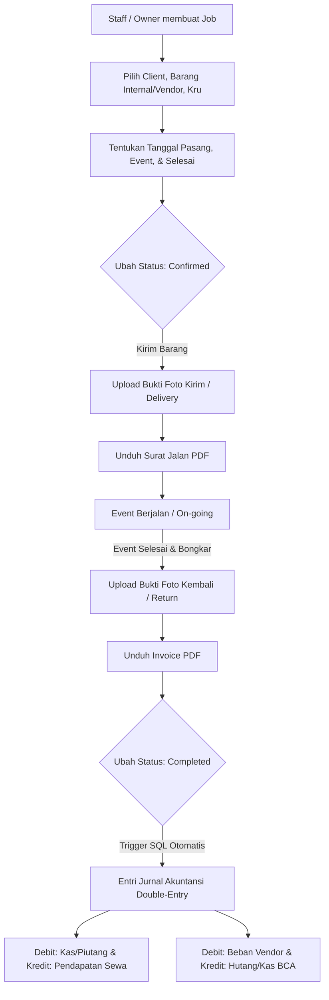

# Panduan Pengembangan (Development Guidelines)

**PENTING: ATURAN MUTLAK TERKAIT INTEGRITAS DATA**

Ketika melakukan pengembangan, penambahan fitur, atau modifikasi apa pun pada website ini di masa mendatang, Anda **DIWAJIBKAN** untuk mematuhi aturan berikut secara ketat:

1. **Preservasi Data Utama**: Semua data yang saat ini sudah ada di dalam website **TIDAK BOLEH dihapus, ditimpa, atau diganti**. Biarkan data yang sudah ada tetap utuh seperti apa adanya sekarang.
2. **Pengembangan Bersifat Aditif (Menambahkan, Bukan Mengurangi)**: Jika ada penambahan fitur baru apa pun, lakukan penambahan (*append*) tanpa merusak atau menghilangkan fungsionalitas dan data lama. Fitur baru harus diimplementasikan dengan cara menambahkan kode/data baru, bukan menghapus atau mengubah data yang sudah berjalan.
3. **Integritas Sistem (Sesuai Standar Cashflow)**: Layaknya pengembangan pada proyek *cashflow*, data lama harus selalu dijaga sebagai data permanen yang tidak tergantikan.
4. **Perubahan Skema/Struktur**: Apabila fitur baru memerlukan perubahan struktur data, pastikan untuk menambahkan *field* atau skema baru tanpa membuang atau memodifikasi *field* lama yang telah ada nilainya.
5. **Akses Pengguna (Role Guest)**: Pengguna dengan role `guest` secara mutlak **tidak diperbolehkan** melihat saldo, laporan keuangan secara keseluruhan (seperti Neraca Saldo, Neraca Lajur, dll), aktiva tetap, atau data transaksi yang dibuat oleh pengguna lain (khususnya milik Owner). Hak akses mereka dibatasi hanya pada data transaksi yang mereka buat sendiri.

Aturan ini dibuat untuk memastikan website yang berjalan sekarang tidak mengalami kehilangan data penting selama proses penambahan atau pembaruan sistem di kemudian hari.

---

# Rencana Implementasi & Perancangan Ulang Sistem Dashboard ERP
**Beragam Sewa Bali — POS & Rental Management System (Next.js Stack)**

Sistem ini dirancang untuk mengintegrasikan manajemen penyewaan alat event (sound system, genset, tenda, dekorasi, dll.) di Bali dengan pencatatan keuangan akuntansi *double-entry* pada platform `cashflow.beragamsewabali.com`.

## Tech Stack (Identik dengan Cashflow)

| Komponen       | Teknologi                  |
| :------------- | :------------------------- |
| Framework      | Next.js 16 (App Router)    |
| Bahasa         | TypeScript (strict mode)   |
| Styling        | Tailwind CSS v4            |
| UI Icons       | Lucide React               |
| State          | React hooks (useState/useEffect/useCallback) |
| Backend        | Supabase (PostgreSQL + Auth + Storage + RLS) |
| Theme          | next-themes (dark/light)   |
| Charts         | Recharts                   |
| Build Output   | Static Export (SSG)        |

---

## 1. Matriks Akses Pengguna (Role-Based Access Control)

Sistem menggunakan hak akses berbasis peran (RBAC) dengan kebijakan Row Level Security (RLS) di Supabase.

| Fitur / Halaman | Owner | Accounting | Staff | Guest |
| :--- | :---: | :---: | :---: | :---: |
| **Ringkasan (Dashboard Analytics)** | Ya (Penuh) | Ya (Penuh) | Ya (Terbatas) | Ya (Data Sendiri) |
| **Manajemen Akun (COA)** | Ya (Penuh) | Ya (Penuh) | Lihat Saja | Tidak Boleh |
| **Aktiva Tetap (Fixed Assets)** | Ya (Penuh) | Ya (Penuh) | Tidak Boleh | Tidak Boleh |
| **Transaksi Jurnal Keuangan** | Ya (Penuh) | Ya (Penuh) | Tidak Boleh | Hanya Milik Sendiri |
| **Neraca Lajur & Laporan** | Ya (Penuh) | Ya (Penuh) | Tidak Boleh | Tidak Boleh |
| **Manajemen Item & Inventaris** | Ya (Penuh) | Lihat Saja | Ya (Ubah Status) | Tidak Boleh |
| **Manajemen Supplier/Vendor** | Ya (Penuh) | Lihat Saja | Lihat Saja | Tidak Boleh |
| **Manajemen Job / Sewa** | Ya (Penuh) | Lihat Saja | Ya (Kelola Job) | Hanya Milik Sendiri |
| **Bukti Foto Serah Terima** | Ya (Penuh) | Lihat Saja | Ya (Upload) | Hanya Milik Sendiri |
| **Generasi Surat Jalan & Invoice PDF**| Ya (Penuh) | Ya (Penuh) | Ya (Hanya Surat Jalan) | Tidak Boleh |
| **Audit Logs** | Ya (Penuh) | Tidak Boleh | Tidak Boleh | Tidak Boleh |

> [!IMPORTANT]
> Khusus untuk role `guest`, RLS di database harus membatasi record yang tampil agar hanya menampilkan transaksi dan job yang kolom `created_by` nilainya sama dengan `auth.uid()`.

---

## 2. Perluasan Skema Database (Supabase PostgreSQL)

Untuk menampung fitur *Job/Rental Management*, kru lapangan, integrasi vendor, foto bukti, dan integrasi otomatis dengan sistem jurnal keuangan, berikut adalah rancangan tabel tambahan yang wajib dieksekusi di Supabase SQL Editor. Lihat file `migration.sql` untuk SQL lengkap.

---

## 3. Alur Kerja (Workflow) & Integrasi Sistem Jurnal Keuangan

Ketika status sebuah Job diubah menjadi `completed`, sistem secara otomatis akan membuat jurnal penyesuaian double-entry ke dalam tabel `transactions` dan `journal_entries` di modul Cashflow melalui trigger `tr_sync_completed_job`.



---

## 4. Standard Visualisasi & Desain Antarmuka (UI/UX)

### A. Status Bar & Kode Warna Penjadwalan
Setiap job direpresentasikan dengan label warna berdasarkan status:
*   **Draft**: `#64748B` (Slate Gray)
*   **Confirmed**: `#3B82F6` (Royal Blue)
*   **On-Going**: `#F59E0B` (Amber)
*   **Completed**: `#10B981` (Emerald Green)
*   **Cancelled**: `#EF4444` (Rose Red)

### B. Widget Visualisasi Schedule Timeline (Gantt Chart)
Dashboard menampilkan grafik batang horizontal interaktif untuk melacak jadwal (komponen `GanttScheduler`).

---

## 5. Fitur Penunjang Operasional

### A. Upload Foto Bukti Lapangan (Supabase Storage)
Bucket: `job-proofs` — `/delivery/` dan `/return/`

### B. Generasi PDF Dokumen (Surat Jalan & Invoice)
Akan diimplementasikan menggunakan library JavaScript (client-side PDF generation).

---

## 6. Struktur Kode Next.js (`dashboard/`)

```
dashboard/
├── app/
│   ├── globals.css          # Tailwind v4 + custom animations
│   ├── layout.tsx           # Root layout (Inter font, dark theme)
│   ├── page.tsx             # Single-page dashboard (sidebar tabs)
│   └── providers.tsx        # Theme provider (next-themes)
├── components/
│   ├── GanttScheduler.tsx   # Timeline Gantt chart
│   ├── JobDetailModal.tsx   # Detail job (info, barang, kru, bukti foto)
│   └── JobFormModal.tsx     # Form create/edit job
├── lib/
│   ├── supabase.ts          # Supabase client + type definitions
│   └── jobs.ts              # CRUD operations (DAL)
├── migration.sql            # DDL script untuk tabel + RLS + trigger
├── next.config.ts           # Static export config
├── package.json             # Dependencies (identik cashflow)
├── tsconfig.json            # TypeScript strict config
└── postcss.config.mjs       # Tailwind CSS v4 PostCSS plugin
```

---

## 7. Langkah Prioritas Pengembangan Selanjutnya
1.  ✅ **Tech Stack Migration**: Migrasi dari Flutter ke Next.js (identik cashflow).
2.  ✅ **Implementasi UI Dashboard**: Overview stats, job list, Gantt schedule.
3.  ✅ **CRUD Job**: Create, read, update, delete jobs dengan modal forms.
4.  ✅ **RBAC Client-side**: Sidebar menu & action buttons berdasarkan role.
5.  ✅ **Photo Proof Upload**: Upload bukti kirim/kembali ke Supabase Storage.
6.  ✅ **TypeScript Build**: Clean compilation tanpa error.
7.  🔲 **PDF Engine**: Generator Surat Jalan dan Invoice (tahap selanjutnya).
8.  🔲 **Inventory & Supplier Pages**: Halaman kelola barang dan vendor.